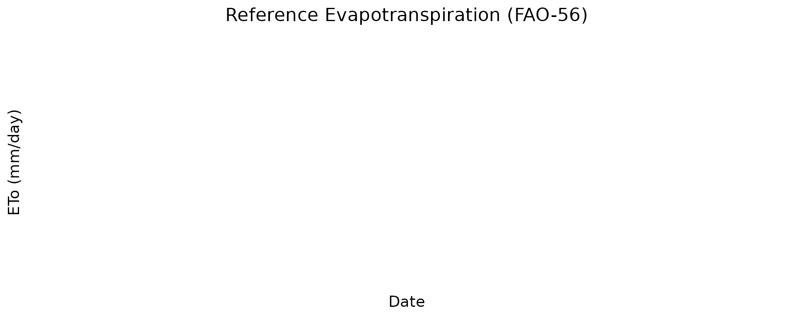

# 💧 ETo Calculation Based on FAO-56 Penman-Monteith

## 🚀 Reference Evapotranspiration (ETo) Estimation

This article demonstrates how to use the BrazilMet package to compute
reference evapotranspiration (ETo) based on the FAO-56 Penman-Monteith
method, using weather data from INMET automatic stations.

## 📦 Load the package

``` r

library(BrazilMet)
```

## 🌍 View available INMET stations

Before downloading data, you can check the available weather stations
with:

``` r

see_stations_info()
#> # A tibble: 564 × 8
#>    station_municipality uf    situation_operation latitude_degrees
#>    <chr>                <chr> <chr>                          <dbl>
#>  1 Abrolhos             BA    breakdown                     -18.0 
#>  2 Acarau               CE    breakdown                      -3.12
#>  3 Afonso Claudio       ES    operating                     -20.1 
#>  4 Agua Boa             MT    operating                     -14.0 
#>  5 Agua Clara           MS    operating                     -20.4 
#>  6 Aguas Emendadas      DF    operating                     -15.6 
#>  7 Aguas Vermelhas      MG    operating                     -15.8 
#>  8 Aimores              MG    operating                     -19.5 
#>  9 Alegre               ES    operating                     -20.8 
#> 10 Alegrete             RS    operating                     -29.7 
#> # ℹ 554 more rows
#> # ℹ 4 more variables: longitude_degrees <dbl>, altitude_m <dbl>,
#> #   operation_start_date <dttm>, station_code <chr>
```

## ⬇️ Download daily weather data

Let’s download daily meteorological data for two stations between
January 2023 and December 2024:

``` r

df <- download_AWS_INMET_daily(
  stations   = c("A001"),
  start_date = "2023-01-01",
  end_date   = "2024-12-31"
)
#> Downloading data for: 2023
#> Warning in utils::download.file(url =
#> paste0("https://portal.inmet.gov.br/uploads/dadoshistoricos/", : URL
#> 'https://portal.inmet.gov.br/uploads/dadoshistoricos/2023.zip': Timeout of 600
#> seconds was reached
#> Warning in value[[3L]](cond): Failed to download data for year 2023: cannot
#> open URL 'https://portal.inmet.gov.br/uploads/dadoshistoricos/2023.zip'
#> Downloading data for: 2024
#> Warning in utils::download.file(url =
#> paste0("https://portal.inmet.gov.br/uploads/dadoshistoricos/", : URL
#> 'https://portal.inmet.gov.br/uploads/dadoshistoricos/2024.zip': Timeout of 600
#> seconds was reached
#> Warning in value[[3L]](cond): Failed to download data for year 2024: cannot
#> open URL 'https://portal.inmet.gov.br/uploads/dadoshistoricos/2024.zip'
#> Warning in download_AWS_INMET_daily(stations = c("A001"), start_date =
#> "2023-01-01", : No data was downloaded for the specified stations and period.
```

The resulting data frame includes temperature, solar radiation, wind
speed, humidity, and atmospheric pressure

## 🧠 Calculate daily ETo using FAO-56

Now we use the daily_eto_FAO56() function to estimate daily ETo values:

``` r

df$eto <- daily_eto_FAO56(
  lat    = df$latitude_degrees,
  tmin   = df$tair_min_c,
  tmax   = df$tair_max_c,
  tmean  = df$tair_mean_c,
  Rs     = df$sr_mj_m2,
  u2     = df$ws_2_m_s,
  Patm   = df$patm_mb,
  RH_max = df$rh_max_porc,
  RH_min = df$rh_min_porc,
  z      = df$altitude_m,
  date   = df$date
)
#> Warning in daily_eto_FAO56(lat = df$latitude_degrees, tmin = df$tair_min_c, :
#> NAs introduced by coercion
```

## 📊 Plotting ETo results

Below is a basic line plot of daily ETo:

``` r


library(ggplot2)

# Ensure date column is in Date format
df$date <- as.Date(df$date)

ggplot(df, aes(x = date, y = eto)) +
  geom_line(color = "darkblue", size = 1) +
  labs(
    title = "Reference Evapotranspiration (FAO-56)",
    x = "Date",
    y = "ETo (mm/day)"
  ) +
  theme_minimal(base_size = 14) +
  theme(
    plot.title = element_text(hjust = 0.5),
    panel.grid.minor = element_blank()
  )
#> Warning: Using `size` aesthetic for lines was deprecated in ggplot2 3.4.0.
#> ℹ Please use `linewidth` instead.
#> This warning is displayed once per session.
#> Call `lifecycle::last_lifecycle_warnings()` to see where this warning was
#> generated.
```



## ✅ Summary

The BrazilMet package allows you to download official INMET weather data
and compute ETo using the FAO-56 method in a reproducible and efficient
way. This is essential for irrigation planning, crop modeling, and
climate-based decision support.

## 🔗 Useful links

<https://github.com/FilgueirasR/BrazilMet>
