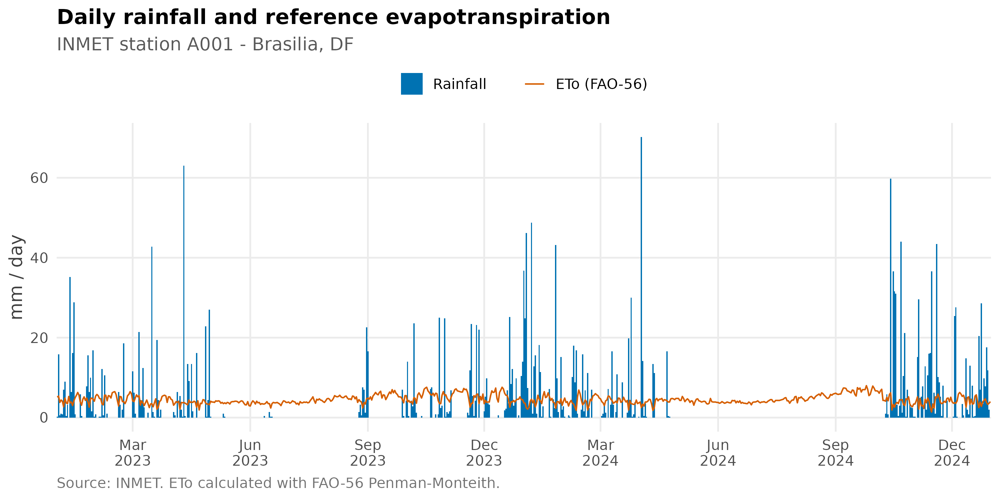
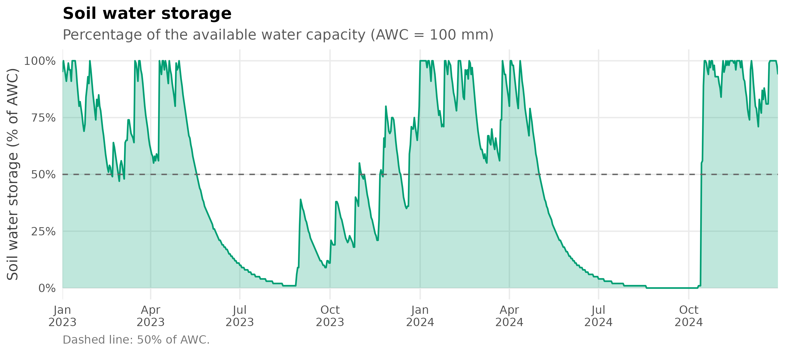
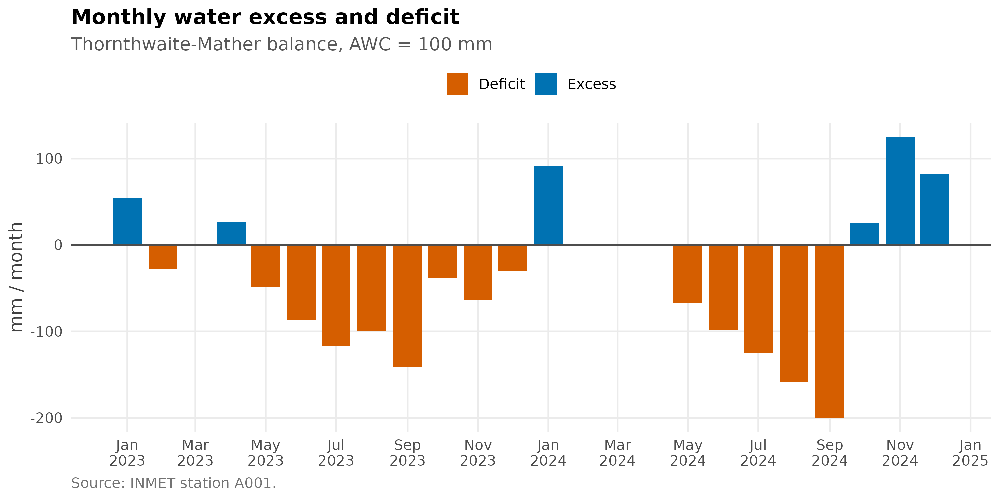
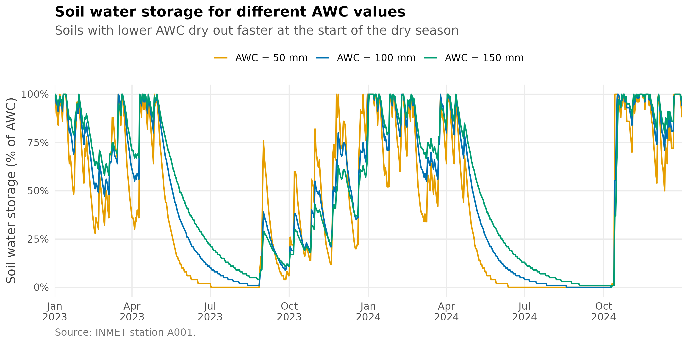

# 🌧️ Sequential Water Balance (Thornthwaite-Mather)

## 🚀 Overview

This article shows how to compute a sequential soil water balance with
[`water_balance()`](https://filgueirasr.github.io/BrazilMet/reference/water_balance.md),
using real daily data from an INMET automatic weather station. The
workflow is:

1.  Load daily weather data for the station.
2.  Fill the short gaps left by sensor failures with
    [`fill_gaps()`](https://filgueirasr.github.io/BrazilMet/reference/fill_gaps.md).
3.  Estimate reference evapotranspiration (ETo) with FAO-56
    Penman-Monteith.
4.  Run the daily water balance for a given available water capacity
    (AWC, also known as CAD).
5.  Aggregate the results into a monthly balance and compare different
    soil AWC values.

The function follows the method of Thornthwaite & Mather (1955). It
tracks the accumulated potential water loss, the soil water storage
(`arm`), actual evapotranspiration (`etr`), water deficit (`def`) and
water excess (`exc`). The time step is defined by the resolution of the
input vectors, so the same function works for daily, weekly or monthly
balances.

## 📦 Load the packages

``` r

library(BrazilMet)
library(ggplot2)
```

## ⬇️ Weather data

Daily data for station A001 (Brasília, DF) between January 2023 and
December 2024 can be obtained with:

``` r

df <- download_AWS_INMET_daily(
  stations   = "A001",
  start_date = "2023-01-01",
  end_date   = "2024-12-31"
)
```

To keep this article reproducible without depending on the INMET server,
the data downloaded with the call above are bundled with the package and
loaded here:

``` r

df <- readRDS(system.file("extdata", "A001_daily_2023_2024.rds", package = "BrazilMet"))
df$date <- as.Date(df$date)

df[1:5, c("station_code", "date", "tair_mean_c", "rainfall_mm", "sr_mj_m2")]
#>   station_code       date tair_mean_c rainfall_mm sr_mj_m2
#> 1         A001 2023-01-01    22.28333         0.2  23.8966
#> 2         A001 2023-01-02    22.64583        15.8  23.1633
#> 3         A001 2023-01-03    20.79167         0.6  15.6981
#> 4         A001 2023-01-04    20.74167         1.0  19.6419
#> 5         A001 2023-01-05    21.25833         0.8  17.6351
```

## 🧩 Filling gaps in the weather data

Automatic stations have occasional sensor failures, and the functions
that follow need complete series. Count the missing values in the
variables used to compute ETo:

``` r

eto_vars <- c("tair_mean_c", "tair_min_c", "tair_max_c", "rh_max_porc",
              "rh_min_porc", "ws_2_m_s", "patm_mb", "sr_mj_m2")

colSums(is.na(df[eto_vars]))
#> tair_mean_c  tair_min_c  tair_max_c rh_max_porc rh_min_porc    ws_2_m_s 
#>          29          29          29          30          30          33 
#>     patm_mb    sr_mj_m2 
#>          28           7
```

[`fill_gaps()`](https://filgueirasr.github.io/BrazilMet/reference/fill_gaps.md)
fills isolated gaps by linear interpolation. Only gaps of up to
`max_gap` days are filled, so long outages are never invented, and a
`*_filled` column flags every filled value. Rainfall is deliberately not
filled: it is intermittent, so interpolation would create rain that did
not occur (there are no missing rainfall values in this series).

``` r

df <- fill_gaps(df, vars = eto_vars, max_gap = 3)
#> Filled values (remaining NA): tair_mean_c = 29 (0), tair_min_c = 29 (0), tair_max_c = 29 (0), rh_max_porc = 30 (0), rh_min_porc = 30 (0), ws_2_m_s = 33 (0), patm_mb = 28 (0), sr_mj_m2 = 7 (0)

colSums(is.na(df[eto_vars]))
#> tair_mean_c  tair_min_c  tair_max_c rh_max_porc rh_min_porc    ws_2_m_s 
#>           0           0           0           0           0           0 
#>     patm_mb    sr_mj_m2 
#>           0           0
```

## 🧠 Reference evapotranspiration (ETo)

ETo is calculated with
[`daily_eto_FAO56()`](https://filgueirasr.github.io/BrazilMet/reference/daily_eto_FAO56.md)
and rounded to 0.1 mm:

``` r

df$eto <- round(daily_eto_FAO56(
  lat    = df$latitude_degrees,
  tmin   = df$tair_min_c,
  tmax   = df$tair_max_c,
  tmean  = df$tair_mean_c,
  Rs     = df$sr_mj_m2,
  u2     = df$ws_2_m_s,
  Patm   = df$patm_mb,
  RH_max = df$rh_max_porc,
  RH_min = df$rh_min_porc,
  z      = df$altitude_m,
  date   = df$date
), 1)

anyNA(df$eto)
#> [1] FALSE
```

## 📊 Rainfall and ETo

Before running the balance, it helps to look at the climatic demand
(ETo) against the supply (rainfall). The wet season (October to April)
and the dry season (May to September) are clearly distinct:

``` r

ggplot(df, aes(x = date)) +
  geom_col(aes(y = rainfall_mm, fill = "Rainfall"), width = 1) +
  geom_line(aes(y = eto, colour = "ETo (FAO-56)"), linewidth = 0.5) +
  scale_fill_manual(values = c("Rainfall" = col_rain)) +
  scale_colour_manual(values = c("ETo (FAO-56)" = col_eto)) +
  scale_x_date(date_breaks = "3 months", date_labels = "%b\n%Y", expand = c(0, 0)) +
  labs(
    title    = "Daily rainfall and reference evapotranspiration",
    subtitle = "INMET station A001 - Brasilia, DF",
    x        = NULL,
    y        = "mm / day",
    caption  = "Source: INMET. ETo calculated with FAO-56 Penman-Monteith."
  ) +
  theme_bm()
```



## 🌱 Daily water balance

Now we run the balance. `AWC` is the soil available water capacity in
the same units as the inputs (mm). Here we use 100 mm, a typical value
for a crop with a moderately deep root system:

``` r

bal_daily <- water_balance(
  ppt       = df$rainfall_mm,
  etp       = df$eto,
  AWC       = 100,
  period    = df$date,
  time_step = "daily"
)

head(bal_daily)
#>       period  ppt etp time_step ppt_etp neg_ac arm alt etr def exc awc_arm
#> 1 2023-01-01  0.2 5.1     daily    -4.9     -5  95  -5 5.0 0.1   0      95
#> 2 2023-01-02 15.8 5.4     daily    10.4      0 100   5 5.4 0.0   5     100
#> 3 2023-01-03  0.6 3.8     daily    -3.2     -3  97  -3 3.8 0.0   0      97
#> 4 2023-01-04  1.0 4.4     daily    -3.4     -6  94  -3 4.0 0.4   0      94
#> 5 2023-01-05  0.8 4.1     daily    -3.3     -9  91  -3 4.0 0.1   0      91
#> 6 2023-01-06  7.0 2.7     daily     4.3     -5  95   4 2.7 0.0   0      95
```

The columns are:

| Column    | Meaning                                  |
|-----------|------------------------------------------|
| `ppt_etp` | Precipitation minus ETo                  |
| `neg_ac`  | Accumulated potential water loss         |
| `arm`     | Soil water storage                       |
| `alt`     | Change in soil water storage             |
| `etr`     | Actual evapotranspiration                |
| `def`     | Water deficit (`etp - etr`)              |
| `exc`     | Water excess (drainage or runoff)        |
| `awc_arm` | Percentage of the AWC stored in the soil |

### Soil water storage

The storage as a percentage of the AWC shows when the soil is full, when
it dries out and how fast it is replenished:

``` r

ggplot(bal_daily, aes(x = period, y = awc_arm)) +
  geom_area(fill = col_storage, alpha = 0.25) +
  geom_line(colour = col_storage, linewidth = 0.7) +
  geom_hline(yintercept = 50, linetype = "dashed", colour = "grey40") +
  scale_x_date(date_breaks = "3 months", date_labels = "%b\n%Y", expand = c(0, 0)) +
  scale_y_continuous(limits = c(0, 100), labels = function(x) paste0(x, "%")) +
  labs(
    title    = "Soil water storage",
    subtitle = "Percentage of the available water capacity (AWC = 100 mm)",
    x        = NULL,
    y        = "Soil water storage (% of AWC)",
    caption  = "Dashed line: 50% of AWC."
  ) +
  theme_bm()
```



## 📅 Monthly water balance

The same function can be applied to any time step. Below, daily rainfall
and ETo are summed by month and the balance is recalculated with
`time_step = "monthly"`:

``` r

df$month <- as.Date(format(df$date, "%Y-%m-01"))

monthly <- aggregate(cbind(rainfall_mm, eto) ~ month, data = df, FUN = sum)

bal_monthly <- water_balance(
  ppt       = monthly$rainfall_mm,
  etp       = monthly$eto,
  AWC       = 100,
  period    = monthly$month,
  time_step = "monthly"
)

head(round(bal_monthly[, c("ppt", "etp", "arm", "etr", "def", "exc")], 1), 6)
#>     ppt   etp arm   etr  def exc
#> 1 190.8 136.5 100 136.5  0.0  54
#> 2  55.0 140.7  42 113.0 27.7   0
#> 3 135.2 129.2  48 129.2  0.0   0
#> 4 187.6 108.8 100 108.8  0.0  27
#> 5   1.4 118.4  31  70.0 48.4   0
#> 6   2.2 108.4  11  22.0 86.4   0
```

The classic extended water balance chart displays the monthly water
excess (above zero) and water deficit (below zero):

``` r

ggplot(bal_monthly, aes(x = period)) +
  geom_col(aes(y = exc, fill = "Excess"), width = 25) +
  geom_col(aes(y = -def, fill = "Deficit"), width = 25) +
  geom_hline(yintercept = 0, colour = "grey30") +
  scale_fill_manual(values = c("Excess" = col_excess, "Deficit" = col_deficit)) +
  scale_x_date(date_breaks = "2 months", date_labels = "%b\n%Y") +
  labs(
    title    = "Monthly water excess and deficit",
    subtitle = "Thornthwaite-Mather balance, AWC = 100 mm",
    x        = NULL,
    y        = "mm / month",
    caption  = "Source: INMET station A001."
  ) +
  theme_bm()
```



### Annual summary

``` r

bal_monthly$year <- format(bal_monthly$period, "%Y")

annual <- aggregate(cbind(ppt, etp, etr, def, exc) ~ year, data = bal_monthly, FUN = sum)
names(annual) <- c("Year", "Rainfall", "ETo", "ETR", "Deficit", "Excess")

knitr::kable(annual, digits = 0, caption = "Annual water balance components (mm)")
```

| Year | Rainfall |  ETo |  ETR | Deficit | Excess |
|:-----|---------:|-----:|-----:|--------:|-------:|
| 2023 |      996 | 1667 | 1014 |     653 |     81 |
| 2024 |     1399 | 1625 |  973 |     652 |    325 |

Annual water balance components (mm) {.table}

## 🔬 Effect of the soil AWC

The AWC controls how much water the soil can store, and it is the main
parameter to adapt the balance to a given crop or soil. Here the daily
balance is run for three AWC values:

``` r

awc_values <- c(50, 100, 150)

bal_awc <- do.call(rbind, lapply(awc_values, function(awc) {
  b <- water_balance(
    ppt       = df$rainfall_mm,
    etp       = df$eto,
    AWC       = awc,
    period    = df$date,
    time_step = "daily"
  )
  b$AWC <- factor(paste("AWC =", awc, "mm"), levels = paste("AWC =", awc_values, "mm"))
  b
}))
```

``` r

ggplot(bal_awc, aes(x = period, y = awc_arm, colour = AWC)) +
  geom_line(linewidth = 0.7) +
  scale_colour_manual(values = c("#E69F00", "#0072B2", "#009E73")) +
  scale_x_date(date_breaks = "3 months", date_labels = "%b\n%Y", expand = c(0, 0)) +
  scale_y_continuous(limits = c(0, 100), labels = function(x) paste0(x, "%")) +
  labs(
    title    = "Soil water storage for different AWC values",
    subtitle = "Soils with lower AWC dry out faster at the start of the dry season",
    x        = NULL,
    y        = "Soil water storage (% of AWC)",
    caption  = "Source: INMET station A001."
  ) +
  theme_bm()
```



``` r

total_deficit <- aggregate(def ~ AWC, data = bal_awc, FUN = sum)
names(total_deficit) <- c("Soil", "Total deficit (mm)")

knitr::kable(total_deficit, caption = "Total water deficit in the period, by AWC")
```

| Soil         | Total deficit (mm) |
|:-------------|-------------------:|
| AWC = 50 mm  |             1796.6 |
| AWC = 100 mm |             1634.4 |
| AWC = 150 mm |             1528.2 |

Total water deficit in the period, by AWC {.table}

## ✅ Summary

[`water_balance()`](https://filgueirasr.github.io/BrazilMet/reference/water_balance.md)
turns precipitation and ETo into storage, actual evapotranspiration,
deficit and excess for any time step and any AWC. Combined with
[`daily_eto_FAO56()`](https://filgueirasr.github.io/BrazilMet/reference/daily_eto_FAO56.md)
and the INMET data from
[`download_AWS_INMET_daily()`](https://filgueirasr.github.io/BrazilMet/reference/download_AWS_INMET_daily.md),
it provides a reproducible workflow for irrigation management and
agroclimatic analysis.

## 📚 Reference

Thornthwaite, C. W., & Mather, J. R. (1955). *The water balance.*
Publications in Climatology, 8(1), 1-104.

## 🔗 Useful links

<https://github.com/FilgueirasR/BrazilMet>
